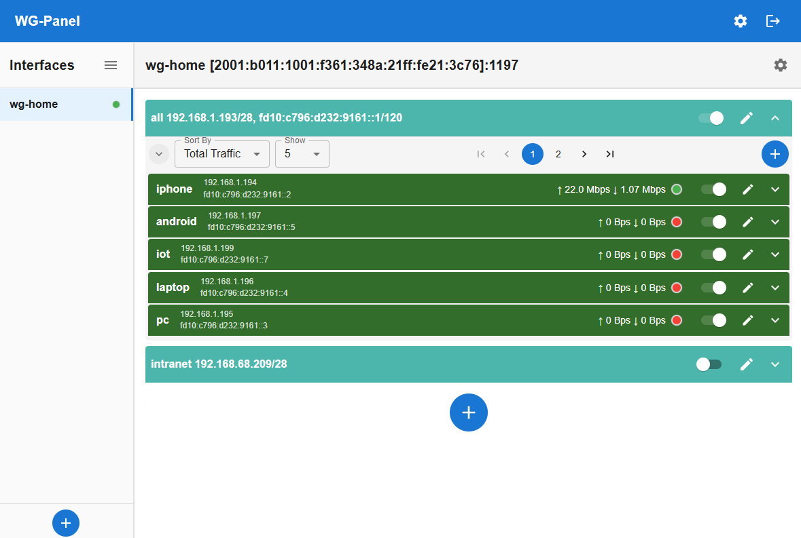
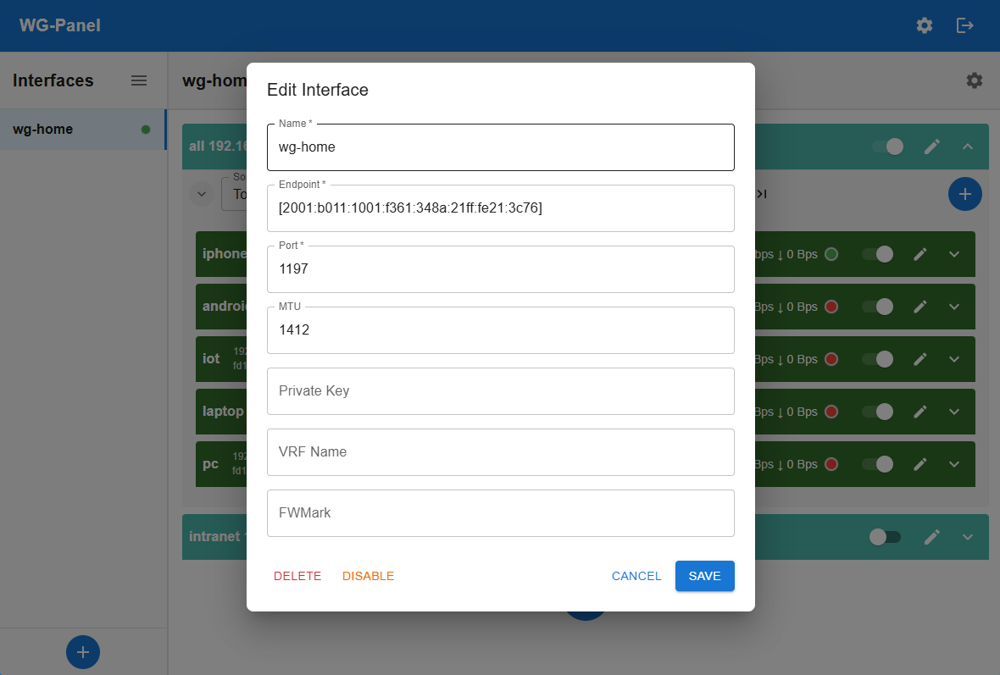
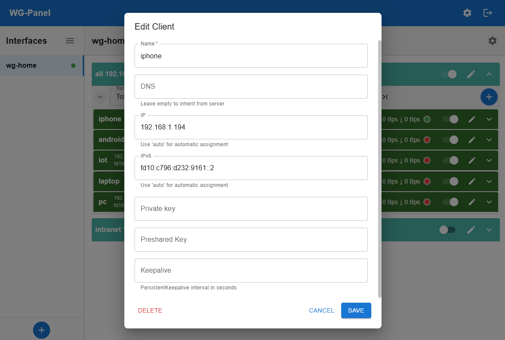
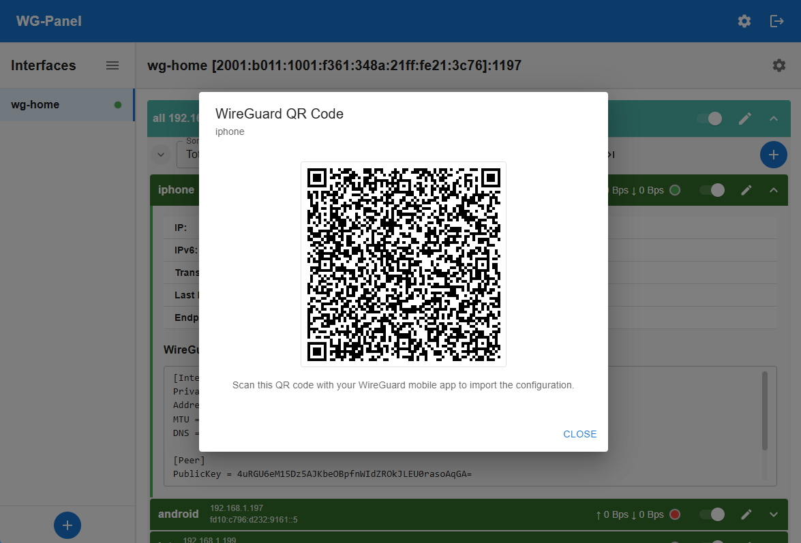

[繁體中文](README_zh.md)

# WG-Panel

WG-Panel is a web-based management panel for WireGuard Server, designed to simplify the setup and administration of your VPN server. 



## Requirements

Before installing WG-Panel, ensure your system meets the following requirements:

### System Tools

The following tools must be installed on your system:
- **iproute2** (`ip` command) - For network interface management
- **WireGuard tools** (`wg`, `wg-quick`) - For WireGuard VPN functionality  
- **iptables** (`iptables`, `ip6tables`, `iptables-save`, `ip6tables-save`) - For firewall management

**Ubuntu/Debian:**
```bash
apt-get update
apt-get install iproute2 wireguard-tools iptables
```

**RHEL/CentOS/Rocky Linux:**
```bash
yum install iproute wireguard-tools iptables
# or for newer versions:
dnf install iproute wireguard-tools iptables
```

### System Configuration

**IP Forwarding** must be enabled for proper VPN functionality:

```bash
# Enable IPv4 forwarding
echo 'net.ipv4.ip_forward = 1' >> /etc/sysctl.conf

# Enable IPv6 forwarding
echo 'net.ipv6.conf.all.forwarding = 1' >> /etc/sysctl.conf

# Apply changes
sysctl -p
```

**Firewall Configuration** - Ensure the FORWARD chain allows traffic:

```bash
# Set iptables FORWARD policy to ACCEPT
iptables -P FORWARD ACCEPT

# Set ip6tables FORWARD policy to ACCEPT  
ip6tables -P FORWARD ACCEPT

# Make persistent (Ubuntu/Debian)
iptables-save > /etc/iptables/rules.v4
ip6tables-save > /etc/iptables/rules.v6
```

> **Note:** WG-Panel will check these requirements on startup and display warnings if any are missing or misconfigured.

## Installation

### Quick Install (Recommended)

Run the automated installation script as root:

```bash
curl -fsSL https://raw.githubusercontent.com/KusakabeShi/Wireguard-Panel/refs/heads/main/install.sh | bash
```

This script will:
- Download the latest WG-Panel binary for your architecture
- Install it to `/usr/local/sbin/wg-panel`
- Create systemd service configuration
- Generate initial configuration and show the admin password
- Start and enable the WG-Panel service

After installation, access the web panel at `http://your-server:5000`

### Manual Installation

1. Download the appropriate binary for your platform from the [releases page](https://github.com/KusakabeShi/Wireguard-Panel/releases)
2. Make it executable: `chmod +x wg-panel`
3. Run it once to generate initial configuration: `./wg-panel`

## Usage

WG-Panel organizes your WireGuard setup into three levels: **Interfaces**, **Servers**, and **Clients**.

### 1. Create an Interface

An interface represents a WireGuard device (e.g., `wg-home-vpn`).

Each interface has the following settings:
* **Name**: The name of the interface (e.g., `wg-home-vpn`).
* **Endpoint**: No effect on the server side. The server's connection domain or IP, used to fill in the Endpoint field when generating client.conf.
* **Private Key**: WireGuard private key. Leave blank to generate automatically.
* **Port**: The listening port for WireGuard.
* **MTU**: The MTU for the WireGuard device. Also used to fill in the MTU field when generating client.conf.
* **VRF Name**: If not empty, the command `ip link set dev {ifname} master {vrfname}` will be executed after the WireGuard interface is created to associate it with a specific VRF.
* **FwMark**: If a value is provided, it will be added to the section `FwMark` of the generated WireGuard server configuration.
    * This sets a firewall mark on the UDP packets ganarates from this interface, enabling advanced policy-based routing. 
    * For example, you can use this mark to direct traffic to a specific routing table: 
        * `ip rule add fwmark 1234 table 5678`
        * `ip route add default via 192.168.23.45 table 5678`


### 2. Create a Server

A server defines a logical group of clients within an interface and their associated network settings.
Multiple servers are allowed within the same interface, each with its own network segment, NAT rules, and clients.

Each server has the following settings:

* **Name**: A descriptive name (e.g., `Personal-Devices`).
* **DNS**: No effect on the server side. Used to fill in the DNS field when generating client.conf.
* **Enable IPv4/IPv6**: Check to enable IPv4/IPv6.
    * **IP/Network**: The internal network for this server in CIDR format (e.g., `10.0.0.1/24`). The server will use the specified IP, and clients will be assigned addresses from this subnet.
        * **Pseudo-bridge master interface**: If checked, and a target physical interface is entered in the master interface field, it must be an L2 interface.
            * The backend will start listening for ARP Request (IPv4) and Neighbor Solicitation (IPv6) on this device.
            * If a received packet matches the server's own internal IP, it will respond with an ARP Reply (IPv4) or Neighbor Advertisement (IPv6).
            * [Pseudo-bridge details](#pseudo-bridge)
    * **Routed Networks**: A list of networks (in CIDR format) that clients are allowed to access through the VPN. This is used to fill in the `AllowedIPs` field when generating client.conf.
    * **Block Non-Routed Network**: If checked, this option will add firewall rules on the server using iptables to ensure that clients can *only* access the networks specified in **Routed Networks**. All other traffic from the client will be dropped.
    * **Enable SNAT**: Check to enable SNAT. If checked, this option will add one of `MASQUERADE`, `SNAT`, or `NETMAP` firewall rules on the server using iptables.
        * [SNAT details](#snat-source-network-address-translation)

### 3. Advanced Server Features

#### Pseudo-Bridge

This feature makes VPN clients appear as if they are on the same Layer 2 network as the specified `Pseudo-Bridge master interface` on the server.
It works by listening for and responding to ARP (IPv4) and Neighbor Discovery (IPv6) requests on the specified master interface, effectively bridging the VPN and local networks.

#### SNAT (Source Network Address Translation)

SNAT translates the client's source IP, allowing clients to access external networks using the server's own IP address. There are three SNAT modes.
The mode used is determined by the **SNAT IP/Net** field:

1. Leave **SNAT IP/Net** blank:
    * Uses **MASQUERADE** mode.
    * Uses the primary IP of the outgoing interface for all traffic. This is the simplest mode.
    * The following iptables rule will be added on the server:
        * `iptables -t nat -A POSTROUTING -s {server network} ! -d {snat excluded network} -j MASQUERADE`
    * The Linux kernel automatically selects the new source IP based on the outgoing interface.
2. Enter a **single IP address** in **SNAT IP/Net**:
    * Uses **SNAT** mode.
    * The following iptables rule will be added on the server:
        * `iptables -t nat -A POSTROUTING -s {server network} ! -d {snat excluded network} -j SNAT --to-source {snat ip}`
    * Manually specifies the new source IP after NAT.
3. Enter a **network in CIDR format** in **SNAT IP/Net**:
    * Uses **NETMAP** mode to perform a 1:1 mapping of the internal `Server IP/Network` to another public network segment entered in `SNAT IP/Net`.
    * The prefix length of `SNAT IP/Net` and `Server IP/Network` must be the same for 1:1 NAT.
    * Currently, only IPv6 NETMAP is supported. IPv4 NETMAP is theoretically possible but not yet implemented. Pull requests are welcome.
    * The following iptables rules will be added on the server:
        * `ip6tables -t nat -A POSTROUTING -s {server network} ! -d {snat excluded network} -j NETMAP --to {snat ipnet}`
        * `ip6tables -t nat -A PREROUTING -d {snat ipnet} -j NETMAP --to {server network}`
4. **SNAT Excluded network**: Networks to be excluded from SNAT.
    * Suitable for environments that require simultaneous access to both internal and external networks.
    * Exclude SNAT for the internal network, using the client's own IP.
    * Use SNAT for the external network, using the server's IP.
5. **Enable SNAT Roaming**: If checked, enables the SNAT Roaming feature.
    * When SNAT Roaming is enabled, the backend automatically calculates the outgoing IP and updates the `-j SNAT --to-source {snat ip}` and `-j NETMAP --to {snat ipnet}` rules.
        * After enabling SNAT Roaming, the backend will use the IP address bound to the `SNAT Roaming master interface` as a basis to calculate the **correct outgoing IP to use**.
        * It also uses the netlink API to monitor IP address changes on the network interface. Whenever the bound IP address is updated, the firewall rules are automatically synchronized and refreshed with a new SNAT rule using iptables.
        * Unlike **MASQUERADE** mode (where the Linux kernel automatically selects the outgoing IP), the outgoing IPs for **SNAT** and **NETMAP** modes are specified by the **SNAT IP/Net** field.
        * Since **MASQUERADE** does not specify an outgoing IP, SNAT Roaming cannot be used with **MASQUERADE** mode.
    * When SNAT Roaming is enabled, there are also **SNAT** and **NETMAP** modes.
        * The SNAT Roaming Service reads the IP address bound to the `master interface` and starts listening for IP change events on this interface using netlink.
        * Whenever an IP change event occurs, the SNAT Roaming Service immediately updates the firewall's SNAT rules using iptables according to the following rules.
        * **SNAT IP/Net** entered as a **single IP address**: Uses **SNAT** mode.
            * When using **SNAT** mode with **SNAT Roaming**, the **SNAT IP/Net** field must be set to `0.0.0.0` or `::`.
            * Whenever the IP changes, the read IP is updated to `-j SNAT --to-source {snat ip}`.
        * **SNAT IP/Net** entered as a **network in CIDR format**: Uses **NETMAP** mode.
            * When using **NETMAP** mode with **SNAT Roaming**, **SNAT IP/Net** is not treated as an IP address, but as an offset.
            * The SNAT Roaming Service will carve out a subnet from the IP network bound to the `master interface` based on the offset, and perform a 1:1 NAT mapping with the Server Network.
            * Example:
                * The `master interface` is bound to the IP address `2a0d:3a87::123/64`. The SNAT Roaming Service will read its network as `2a0d:3a87::/64`.
                * Set the **SNAT IP/Net** offset to `::980d:0/112`.
                * wg-panel will carve out a subnet `2a0d:3a87::980d:0/112` from the `2a0d:3a87::/64` network based on the offset.
                * The Server network is `fd28:f50:55c2::/112`.
                * A NETMAP firewall rule is added to perform a 1:1 NAT mapping from `fd28:f50:55c2::/112` to the public address `2a0d:3a87::980d:0/112`.
    * **SNAT Roaming master interface**: The master interface selected by the SNAT Roaming Service.
    * **SNAT NETMAP pseudo-bridge**: To be completed.


### 4. Create a Client

Finally, create clients for your server.

1. Select a server and go to the "Clients" tab.
2. Click "Create" and configure the client.

Each client has the following settings:
* **Name**: A descriptive name (e.g., `MyLaptop`).
* **DNS**: No effect on the server side. Used to fill in the DNS field when generating client.conf.
* **IP/IPv6**: You can manually assign specific IPs or set it to `auto` to have WG-Panel assign the next available address from the server's network.
* **Private Key**: Leave this blank to automatically generate a new key pair, or provide an existing private key from the client.
* **Preshared Key**: Leave blank to not use, or provide a Preshared Key.
* **KeepAlive**: No effect on the server side. Used to fill in the `PersistentKeepalive` field when generating client.conf.




### 5. View Client Details and Config

After a client is created, you can view its detailed status from the client list.

1. Click the expand button next to the client item.
2. A detailed view will appear, showing the client's real-time connection status, including:
    * **IP**: The client's internal IPv4 address.
    * **IPv6**: The client's internal IPv6 address.
    * **Transferred**: The client's total traffic. Restarting/resetting WireGuard will reset the statistics.
    * **Last Handshake**: The time of the client's last handshake.
    * **Endpoint**: The client's connection IP address.
3. It also displays the complete **WireGuard configuration**, allowing you to download, copy, or generate a QR code.
    * 
4. Click the **QR Code** button to display a scannable QR code for easy import onto mobile devices.
    * 