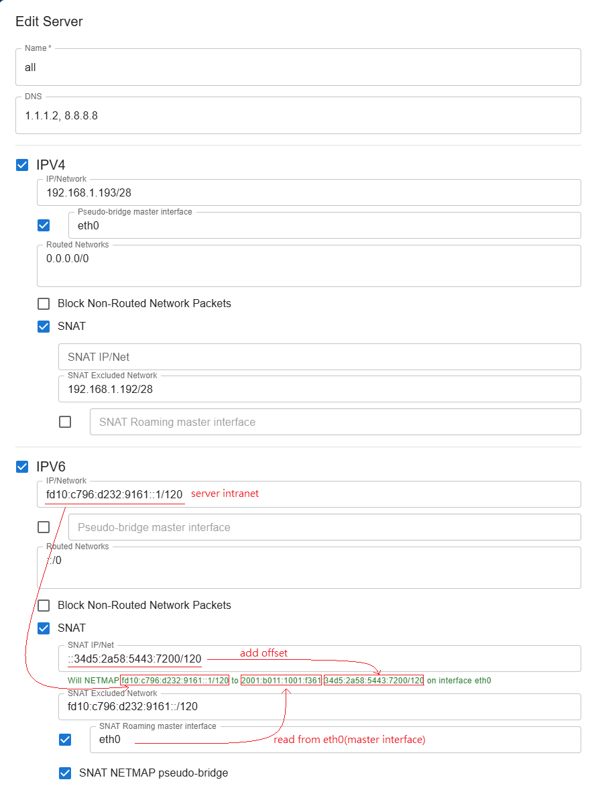

[English](README.md)

# WG-Panel

WG-Panel 是一個 WireGuard Server 網頁管理面板，用於簡化 Wireguard VPN 伺服器的設定和管理。


## 系統需求

安裝 WG-Panel 前，請確保您的系統符合以下需求：

### 系統工具

您的系統必須安裝以下工具：
- **iproute2** (`ip` 指令) - 用於網路介面管理
- **WireGuard 工具** (`wg`, `wg-quick`) - 用於 WireGuard VPN 功能
- **iptables** (`iptables`, `ip6tables`, `iptables-save`, `ip6tables-save`) - 用於防火牆管理

**Ubuntu/Debian：**
```bash
apt-get update
apt-get install iproute2 wireguard-tools iptables
```

**RHEL/CentOS/Rocky Linux：**
```bash
yum install iproute wireguard-tools iptables
# 或者較新版本使用：
dnf install iproute wireguard-tools iptables
```

### 系統設定

**IP 轉發** 必須啟用以確保 VPN 正常運作：

```bash
# 啟用 IPv4 轉發
echo 'net.ipv4.ip_forward = 1' > /etc/sysctl.d/99-wireguard.conf

# 啟用 IPv6 轉發
echo 'net.ipv6.conf.all.forwarding = 1' >> /etc/sysctl.d/99-wireguard.conf

# 套用變更
sysctl -p /etc/sysctl.d/99-wireguard.conf
```

## 安裝

### 快速安裝（建議）

以 root 身份執行自動安裝腳本：

```bash
curl -fsSL https://raw.githubusercontent.com/KusakabeShi/Wireguard-Panel/refs/heads/main/install.sh | bash
```

此腳本將會：
- 為您的架構下載最新的 WG-Panel 執行檔
- 將其安裝到 `/usr/local/sbin/wg-panel`
- 建立 systemd 服務設定
- 產生初始設定並顯示管理員密碼
- 啟動並啟用 WG-Panel 服務

安裝完成後，可透過 `http://your-server:5000` 存取網頁面板

### 手動安裝

1. 從[發佈頁面](https://github.com/KusakabeShi/Wireguard-Panel/releases)下載適合您平台的執行檔
2. 設定可執行權限：`chmod +x wg-panel`
3. 執行一次以產生初始設定：`./wg-panel`

## CLI 參數

WG-Panel 支援以下指令行參數：

- `-c [configpath]`：可選。指定設定檔的路徑。如果未提供，預設為 `./config.json`。如果檔案不存在，將會建立一個包含隨機密碼的設定檔，並將密碼顯示在控制台中。
- `-p [new_password]`：在設定檔中設定新密碼。

### 範例

```bash
# 使用預設設定檔執行（./config.json）
./wg-panel

# 使用自訂設定檔執行
./wg-panel -c /etc/wireguard-panel/config.json

# 重設密碼
./wg-panel -p mynewpassword

# 將指定的 config 重設密碼
./wg-panel -c /etc/wireguard-panel/config.json -p mynewpassword
```

## 使用方法

WG-Panel 將設定分成成三個層級：**Interfaces**、**Servers** 和 **Clients**。

### 1. Create an Interface

Interface 代表一個 WireGuard 裝置（例如 `wg-home-vpn`）

每個 Interface 有以下設定:
* **Name**：Interface 的名稱（例如 `wg-home-vpn`）
* **Endpoint**：Server 端無作用。伺服器的連線 domain 或 IP，用於生成 client.conf 時，填入裡面的 Endpoint 欄位
* **Private Key**：Wireguard 私鑰。留空:自動生成
* **Port**: Wireguard 的監聽 Port
* **MTU**: Wireguard 裝置的 MTU。同時作用於生成 client.conf，填入裡面的 MTU 欄位
* **VRF Name**: 若此欄位不為空，則在 WireGuard 介面建立後，會執行 `ip link set dev {ifname} master {vrfname}` 指令，將其關聯到指定的 VRF。
* **FwMark**: 若提供數值，該數值將被加入到 WireGuard 伺服器設定中
    * 這會為此 Wireguard interface 產生的 UDP 封包設定一個防火牆標記，以啟用基於策略的路由
    * 例如，您可以使用此標記將流量導向特定的路由表：
        * `ip rule add fwmark 1234 table 5678`
        * `ip route add default via 192.168.23.45 table 5678`。


### 2. Create a Server

Server 定義了 Interface 內用戶端的邏輯群組及其相關的網路設定  
同一個 Interface 內允許存在多個 Server，每個 Server 有各自的網段， NAT規則和客戶端

每個 Server，每個有以下設定:

* **Name**：一個描述性的名稱（例如 `Personal-Devices`）。
* **DNS**： Server 端無作用。用於生成 client.conf 時，填入裡面的 DNS 欄位 
* **IPv4/IPv6 Checkbox**：是否啟用 IPv4/IPv6
    * **IP/Network**：此伺服器的內部網路，格式為 CIDR（例如 `10.0.0.1/24`）。伺服器將使用指定的 IP，並從該子網路中為用戶端分配位址。
        * **Pseudo-bridge master interface**: 若勾選，並在 master interface 填入目標 physical interface ，必須是 L2 interface  
            * 後端會開始在此設備上監聽 ARP Request(ipv4) 和 Neighbor Solicitation(IPv6)
            * 如果監聽到的封包符合 server 自己的內網 IP ，就回應 ARP Reply(IPv4) 或 Neighbor Advertisement(IPv6)
            * [Pseudo-bridge 細節說明](#pseudo-bridge)
    * **Routed Networks**：用戶端允許透過 VPN 存取的網路列表（CIDR 格式）。用於生成 client.conf 時，填入裡面的 `AllowedIPs` 欄位
    * **Allow Routed Network Only**：若勾選，此選項會在伺服器中使用 iptables 新增防火牆規則，以確保用戶端*僅*能存取 **Routed Networks** 中指定的網路。來自用戶端的所有其他流量將被拒絕。
    * **SNAT Checkbox**: 是否啟用 `IPv4 SNAT`。若勾選，將會在此選項會在伺服器中使用 iptables 新增 `MASQUERADE`, `SNAT`, `NETMAP` 其中一種防火牆規則
        * [SNAT 細節說明](#snat-source-network-address-translation)

### 3. Advanced Server Features

#### Pseudo-Bridge

此功能使 VPN client 看起來像與伺服器中指定的 `Pseudo-Bridge master interface` 在同一個第二層網路上  
它的運作方式是在指定的 master interface 上監聽並回應 ARP（IPv4）和Neighbor Discovery（IPv6）請求，橋接 VPN 網路和本地網路。

#### SNAT (Source Network Address Translation)

SNAT 功能對客戶端的 Source IP 進行轉換，允許用戶端使用伺服器自身的 IP 位址存取外部網路，有三種 SNAT 模式  
具體使用哪種模式由 **SNAT IP/Net** 欄位決定：

1. 將 **SNAT IP/Net** 留空: 
    * 使用 **MASQUERADE** 模式。
    * 對所有流量使用傳出網卡的主 IP。這是最簡單的模式
    * 將使用以下 iptables 於伺服器新增對應防火牆規則:
        * `iptables -t nat -A POSTROUTING -s {server network} ! -d {snat excluded network} -j MASQUERADE ` 
    * 由 linux kernel 根據出口 interface ，自動選擇新的 source IP
2. 在 **SNAT IP/Net** 輸入**單一 IP 地址**:
    * 使用 **SNAT** 模式
    * 將使用以下 iptables 於伺服器新增對應防火牆規則:
        * `iptables -t nat -A POSTROUTING -s {server network} ! -d {snat excluded network} -j SNAT --to-source {snat ip}`
    * 手動指定 NAT 後新的 source IP
3. 在 **SNAT IP/Net** 輸入 **CIDR 格式網段**:
    * 使用 **NETMAP** 模式，將 `Server IP/Network` 的內網網段，完整的 1:1 映射到`SNAT IP/Net` 填入的另一段公網網段
    * `SNAT IP/Net` 的 Prefix length 和 `Server IP/Network` 的 Prefix length 必須相同，才能進行 1:1 NAT
    * 目前只支援 IPv6 NETMAP。理論上支援 IPv4 NETMAP ，但我懶。 PR is welcome
    * 將使用以下 iptables 於伺服器新增防火牆規則:
        * `ip6tables -t nat -A POSTROUTING -s {server network} ! -d {snat excluded network} -j NETMAP --to {snat ipnet}`
        * `ip6tables -t nat -A PREROUTING -d {snat ipnet} -j NETMAP --to {server network}`
4. `SNAT Excluded network`: 排除於 SNAT 的網段
    * 適用於需要同時訪問內網和外網的環境
    * 對內網排除 SNAT，使用 Client 自身 IP
    * 對外網使用 SNAT，使用 Server IP
5. `SNAT Roaming Checkbox`: 若勾選，則啟用 SNAT Roaming 功能
    * SNAT Roaming 啟用時，後端會自動計算出口 IP，更新到 `-j SNAT --to-source {snat ip}` 和 `-j NETMAP --to {snat ipnet}`規則內部
        * 啟用 SNAT Roaming 後，後端將會使用 `SNAT Roaming master interface` 上面綁定的 IP 地址為基礎，計算出**應該使用的出口 IP**
        * 同時使用 netlink API 監聽網卡上面的 IP 地址變化。每當綁定的 IP 地址更新，就自動同步更新防火牆規則，使用 iptables 刷新成新的 SNAT rule
        * 不同於 `MASQUERADE` 模式(由 linux kernel 自動選擇出口 IP)，`SNAT` 和 `NETMAP` 模式的出口IP皆是由 `SNAT IP/Net` 欄位指定
        * 而 `MASQUERADE` 並不指定出口 IP。因此 SNAT Roaming 無法使用於 `MASQUERADE` 模式
    * 當 SNAT Roaming 啟用時，一樣有 `SNAT` 模式和 `NETMAP` 模式
        * SNAT Roaming Service 讀取 `master interface` 上面綁定的 IP 地址，並開始使用 netlink 監聽這個網卡的 IP 變化事件
        * 每當有 IP 變化事件，SNAT Roaming Service 立刻根據下述規則使用 `iptables` 更新防火牆的 SNAT 規則
        * `SNAT IP/Net` 輸入**單一 IP 地址**: 使用 `SNAT` 模式
            * `SNAT` 模式搭配 `SNAT Roaming` 時，`SNAT IP/Net` 欄位必須設定為 `0.0.0.0` 或是 `::`
            * 每當 IP 變化，就將讀取到的 IP 更新到 `-j SNAT --to-source {snat ip}` 
        * `SNAT IP/Net` 輸入 **CIDR 格式網段**: 使用 `NETMAP` 模式
            * `NETMAP` 模式搭配 `SNAT Roaming` 時，`SNAT IP/Net` 並不視為一個 IP 地址，而是視為一個 offset
            * SNAT Roaming Service 將從 `master interface` 綁定的 IP 網段中，根據 offset 切割出一段子網段，和 Server Network 做 1:1 NAT 映射
            * 範例:
                * `master interface` 綁定了 IP 地址 `2a0d:3a87::123/64`，SNAT Roaming Service 會讀取到該網段為 `2a0d:3a87::/64`
                * 將 `SNAT IP/Net` 設定 offset 為 `::980d:0/112`
                * wg-panel 會從 `2a0d:3a87::/64` 網段，根據 offset 切割出一段子網段 `2a0d:3a87::980d:0/112` 
                * Server 網路為 `fd28:f50:55c2::/112`
                * 新增 NETMAP 防火牆規則，將 `fd28:f50:55c2::/112` 做 1:1 NAT 映射到公網地址 `2a0d:3a87::980d:0/112` 
    * **SNAT Roaming master interface**:  上述 SNAT Roaming Service 所選定的 master interface ，讀取其 IP 並更新 SNAT/NETMAP 映射範圍
    * **SNAT NETMAP pseudo-bridge**: 監聽 `SNAT Roaming master interface` ，針對 SNAT Roaming 的 NETMAP 模式，將映射後的子網段的 Neighbor Solicitation 請求，回應 Neighbor Advertisement。
        * 因為 linux 的 NETMAP 單純做 IP 轉換，不會對映射 IP 回應 ARP/Neighbor Solicitation 請求，因此同一個二層網路的其他主機不知道這個子網段被映射到 Wireguard client 了，導致連不上
        * 開啟此選項，SNAT Roaming Service 會將映射的子網段通知給 Pseudo-bridge Service ，進行 ARP/NS 的回應，讓外部主機能透過映射後的 IP 連上客戶端




### 4. Create a Client

最後，為您的伺服器建立用戶端。

1. 選擇一個 Server，然後前往 "Clients" 標籤。
2. 點擊 "Create" 並設定用戶端

每個 Client，有以下設定:
* **Name**：一個描述性的名稱（例如 `MyLaptop`）。
* **DNS**： Server 端無作用。用於生成 client.conf 時，填入裡面的 DNS 欄位 
* **IP/IPv6**：您可以手動分配特定 IP，或將其設定為 `auto`，讓 WG-Panel 從伺服器網路中分配下一個可用的位址。
* **Private Key**：將此留空以自動產生新的金鑰對，或提供用戶端現有的私鑰
* **Preshard Key**: 留空不使用，或使用 Preshard Key
* **KeepAlive**: Server 端無作用。用於生成 client.conf 時，填入裡面的 PersistentKeepalive 欄位 


### 5. View Client Details and Config

建立用戶端後，您可以從用戶端列表中查看詳細狀態

1. 點擊用戶端項目旁邊的展開按鈕。
2. 將出現一個詳細檢視頁面，此檢視會顯示用戶端的即時連線狀態，包括：
    * **IP**: 用戶端的內網 IPv4 地址
    * **IPv6**: 用戶端的內網 IPv6 地址
    * **Transferred**: 用戶端總流量。重啟/重置 wireguard 會重設統計
    * **Last Handshake** : wireguard 客戶端的上次握手時間
    * **Endpoint**: 用戶端的連線 IP 位址
3. 並顯示完整的 **WireGuard configuration**，允許下載/複製/生成 QR code
    * 
4. 點擊 **QR Code** 按鈕以顯示可用於掃描的 QR code 以便輕鬆匯入到行動裝置  
    * 
